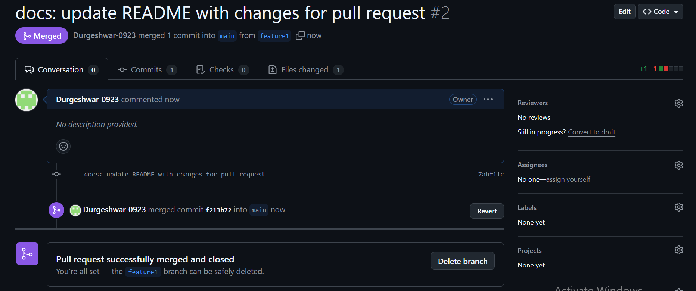

## merge history
c63e9dd - docs(Assign.txt) : Updated Native Place and date (durgeshwar-0923, 2025-05-05)
66c78c9 - docs(Assign.txt) : updated name and college place (durgeshwar-0923, 2025-05-05)
88d8a1f - docs : updated the Native Place and Laptop (durgeshwar-0923, 2025-05-05)
85cab75 - Initial Commit (durgeshwar-0923, 2025-05-05)
commit c63e9ddfc260a4b5f701546fbfd3c7d0ed5e8f80
Author: durgeshwar-0923 <dureshwarupputuri.minfytech.com>
Date:   Mon May 5 14:02:43 2025 +0530

    docs(Assign.txt) : Updated Native Place and date

 Assign.txt | 4 ++--
 1 file changed, 2 insertions(+), 2 deletions(-)

commit 66c78c9656e64a1b49d820a96cb3f5fb08ff5bec
Author: durgeshwar-0923 <dureshwarupputuri.minfytech.com>
Date:   Mon May 5 14:00:27 2025 +0530

    docs(Assign.txt) : updated name and college place

 Assign.txt | 4 ++--
 1 file changed, 2 insertions(+), 2 deletions(-)

commit 88d8a1fad9c57efdc3f9611a00d7ae6aa16b135e
Author: durgeshwar-0923 <dureshwarupputuri.minfytech.com>
Date:   Mon May 5 13:59:11 2025 +0530

    docs : updated the Native Place and Laptop

 Assign.txt | 4 ++--
 1 file changed, 2 insertions(+), 2 deletions(-)

commit 85cab75257c882ad5c8259210f62bb411459628a
Author: durgeshwar-0923 <dureshwarupputuri.minfytech.com>
Date:   Mon May 5 13:40:04 2025 +0530

    Initial Commit

## git diff output
My name is Upputuri Durgeshwar  
College name - Sreenidhi Institute of Science and Technology  
College place - Yamnampet  
Native place - Nagole, Hyderabad  
Surname - Upputuri  
Topic - Assignment 1 for Git  
Laptop - MacBook  
Date - 06/05/2025  
Done  

diff --git a/Assign.txt b/Assign.txt  
index 4b705e0..2123152 100644  
--- a/Assign.txt  
+++ b/Assign.txt  
@@ -1,9 +1,9 @@  
My name is Upputuri Durgeshwar  
College name - Sreenidhi Institute of Science and Technology  
College place - Yamnampet  
-Native place- Medchal  
+Native place- Nagole, Hyderabad  
Surname - Upputuri  
Topic - Assignment 1 for Git  
Laptop - MacBook  
-Date-05/05/2025  
+Date-06/05/2025  
Done  
\ No newline at end of file  

diff --git a/Assign.txt b/Assign.txt  
index a092450..2123152 100644  
--- a/Assign.txt  
+++ b/Assign.txt  
@@ -1,9 +1,9 @@  
-My name is Durgeshwar  
+My name is Upputuri Durgeshwar  
College name - Sreenidhi Institute of Science and Technology  
-College place - Ghatkesar  
-Native place - Hyderabad  
+College place - Yamnampet  
+Native place - Nagole, Hyderabad  
Surname - Upputuri  
Topic - Assignment 1 for Git  
-Laptop - ThinkPad  
-Date - 05/05/2025  
+Laptop - MacBook  
+Date - 06/05/2025  
Done  
\ No newline at end of file  

### second assignment

### second assignment with merge conflicts
# merge conflict after creating pull request

# merge conflict in web interface

# merge succeful after resolving conflict

### screenshot inducing the merge conflicts and adding the screenshot for the second assignment (in vs code)

